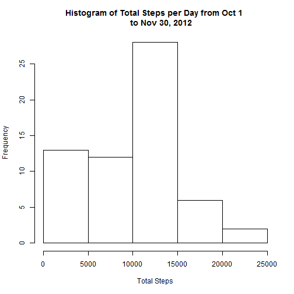
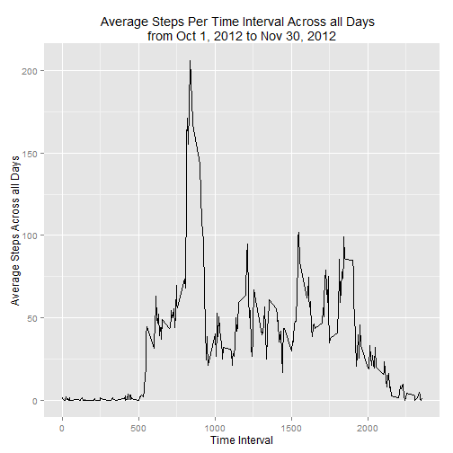
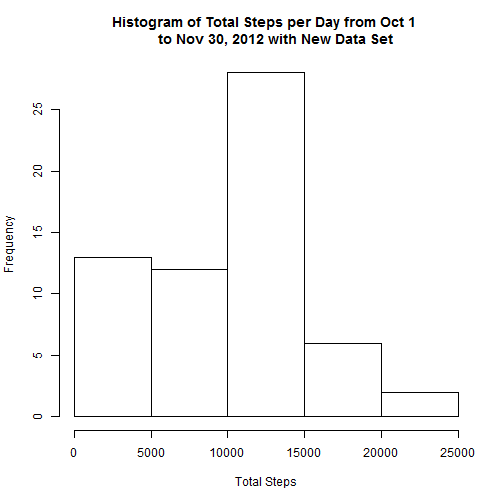
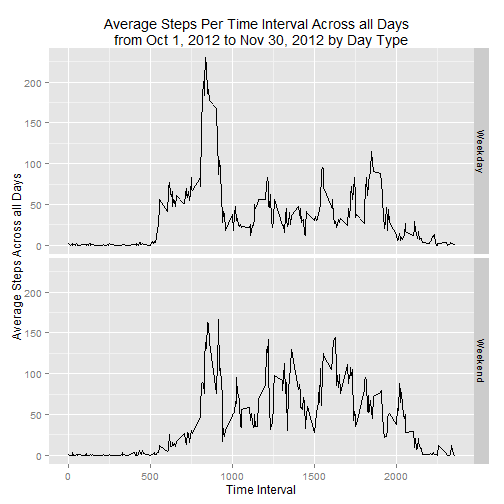

RepData Assignment 1
-----------------
To load the data, first the working directory was set to the RepData_PeerAssignment1 Folder downloaded from Git Hub. Second, the folder "activity.zip" was unzipped and the new folder ("activity") was created within the RepData_PeerAssignment1 Folder.

Do run this code, the libraries 'ggplot2' and 'dplyr' must be installed.

##Prep Work  

###Load Data

```r
directory <-getwd()    
test<-paste(directory, "/", "activity", "/", "activity.csv", sep="")    
data <-read.csv(test)
```

###Clean the data
Convert the date column to Date format and the steps column from integer to numeric

```r
data$date <- as.Date(data$date, format="%Y-%m-%d")
data$steps <- as.numeric(data$steps)
```

##Question One: What is mean total number of steps taken per day?

###Step 1: Calculate the total number of steps per day and plot this on a histogram

```r
## Calculate the total steps per day
library(dplyr)
groupData <- tbl_df(data)
groupData <- group_by(groupData, date)
totSteps <- summarize(groupData, totalSteps=sum(steps, na.rm=TRUE))

##Plot total steps per day on a histogram
hist(totSteps$totalSteps, xlab="Total Steps", main="Histogram of Total Steps per Day from Oct 1 
     to Nov 30, 2012")
```

 

###Step 2: Calculate and report the mean and median total number of steps taken per day

```r
library(dplyr)
totMean <- mean(totSteps$totalSteps, na.rm=TRUE)
totMean <- format(round(totMean, 2), nsmall = 2)

totMed <- median(totSteps$totalSteps, na.rm=TRUE)
totMed <- format(round(totMed, 2), nsmall = 0)
```

The mean total number of steps per day is 9354.23 and the median total number of steps per day is 10395

##Question Two: What is the average daily activity pattern?

###Step 1: Make a time series plot of the 5-minute interval (x-axis) and the average number of steps taken, averaged across all days (y-axis)

```r
##Calculate the average number of steps taken per 5-minute interval across all days
groupData2 <- tbl_df(data)
groupData2 <- group_by(groupData2, interval)
stepsInt <- summarize(groupData2, avgStepsInt=mean(steps, na.rm=TRUE))

##Graph information to create a time series
library(ggplot2)
g <- ggplot(stepsInt, aes(interval, avgStepsInt))
p <- g + geom_line(colour="black")+ labs(x="Time Interval", y="Average Steps Across all Days")+ labs(title="Average Steps Per Time Interval Across all Days  
from Oct 1, 2012 to Nov 30, 2012")
print(p)
```

 


###Step 2: Which 5-minute interval, on average across all the days in the dataset, contains the maximum number of steps?

```r
maxStepInt <- max(stepsInt$avgStepsInt)
max <- subset(stepsInt, avgStepsInt==maxStepInt)
maxInt <- max$interval
maxSteps <-max$avgStepsInt
maxSteps <- format(round(maxSteps, 2), nsmall = 2)
```
The 5-mintue interval, on average across all days from Oct 1 to Nov 30 (2012) with the maximum number of steps is **835** (8 hours and 35 minutes) with a total of **206.17** steps. 


##Question Three: Imputing missing values

###Step 1: Calculate and report the total number of missing values in the dataset (i.e. the total number of rows with NAs)

```r
stepsNA <- sum(is.na(data$steps))
dateNA <- sum(is.na(data$date))
intervalNA <- sum(is.na(data$interval))
```
There are a total of **2304** missing values in the dataset. All missing values are from the Steps variable meaning there is no missing data for the Date or Interval variables. 

###Step 2: Devise a strategy for filling in all of the missing values in the dataset.
Missing step values will be filled in using the average value for the corresponding 5-minute interval, which was calculated above in Question 2. For example, let's say the step value for interval 0 was missing for Nov 30, 2012. In the new data set (see below), the step value will be changed to 1.7169811 as this is the average number of steps for the interval 0 across all days calcuated in Question 2.


###Step 3: Create a new dataset that is equal to the original dataset but with the missing data filled in

```r
count <-length(data$steps)
data2 <- data
for(i in 1:count) {
  if(is.na(data$steps[i])==TRUE) {
    int <- data$interval[i]
    x <- subset(stepsInt, stepsInt$interval==int)
    data2$steps[i] <- x$avgStepsInt
  }
}
newData <- sum(is.na(data2$steps))
```
The original data set (data) had **2304** missing values while the new data set (data2) has **0** missing values. 

###Step 4: Make a histogram of the total number of steps taken each day. Calculate the mean and median total number of steps taken per day. Do these values differ from the estimates from the first part of the assignment? What is the impact of imputing missing data on the estimates of the total daily number of steps?

```r
##calculate the total nmber of steps taken each day for the new data set
groupData3 <- tbl_df(data2)
groupData3 <- group_by(groupData3, date)
totSteps2 <- summarize(groupData, totalSteps=sum(steps, na.rm=TRUE))

##Graph the total steps per day for the new data set
hist(totSteps2$totalSteps, xlab="Total Steps", main="Histogram of Total Steps per Day from Oct 1 
     to Nov 30, 2012 with New Data Set")
```

 

```r
##Calcuate the mean and median of total steps per day for the new data set
totMean2 <- mean(totSteps2$totalSteps, na.rm=TRUE)
totMean2 <- format(round(totMean2, 2), nsmall = 2)

totMed2 <- median(totSteps2$totalSteps, na.rm=TRUE)
totMed2 <- format(round(totMed2, 2), nsmall = 0)
```
In the original data set, the mean total number of steps per day is **9354.23** and the median total number of steps per day is **10395**. In the new data set, the mean total number of steps per day is **9354.23** and the median total number of steps per day is **10395**. As you can see, these values do not differ and thus there appears to be no impact of imputing missing data on the two estimates of the total daily number of steps.

##Question 4: Are there differences in activity patterns between weekdays and weekends?

###Step 1:Create a new factor variable in the dataset with two levels -- "weekday" and "weekend" indicating whether a given date is a weekday or weekend day. 

```r
##add new column (weekday) and calculate the day of the week for each row (e.g. Monday, Tuesday, Wednesday)
count <- length(data2$steps)
for(i in 1:count) {
  data2$weekday[i] <- weekdays(data2$date[i])
}

##convert weekday column to a factor with two levels (Weekday and Weekend)
for(i in 1:count) {
  if(data2$weekday[i]=="Saturday" | data2$weekday[i]=="Sunday")
    data2$weekday[i] <- c("Weekend") 
  else
    data2$weekday[i] <- c("Weekday")
}

data2$weekday <-as.factor(data2$weekday)
```

##Step 2: Make a panel plot containing a time series plot of the 5-minute interval (x-axis) and the average number of steps taken, averaged across all weekday days or weekend days (y-axis).

```r
##Calculate the average number of steps taken per 5-minute interval across all days
groupData4 <- tbl_df(data2)
groupData4 <- group_by(groupData4, weekday, interval)
stepsInt <- summarize(groupData4, avgStepsInt=mean(steps, na.rm=TRUE))

##Graph information to create a time series
g <- ggplot(stepsInt, aes(interval, avgStepsInt))
p <- g + geom_line(colour="black")+ labs(x="Time Interval", y="Average Steps Across all Days")+ labs(title="Average Steps Per Time Interval Across all Days  
from Oct 1, 2012 to Nov 30, 2012 by Day Type") + facet_grid(weekday~.)
print(p)
```

 
